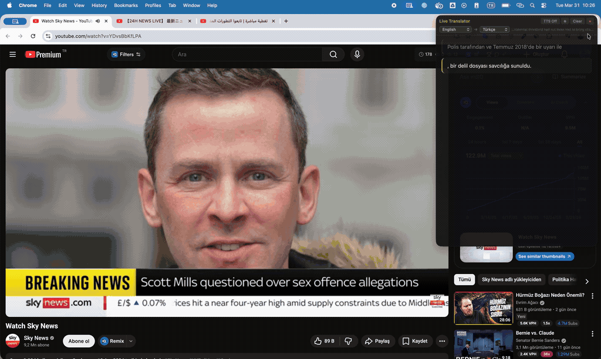

<p align="center">
  
</p>

<h1 align="center">Live Translator</h1>

<p align="center">
  <strong>Real-time system audio translation for macOS</strong><br>
  Translate any audio playing on your Mac — YouTube, podcasts, meetings, movies — live on screen.
</p>

<p align="center">
  <a href="https://github.com/umutcetinkaya/live-translator/releases/latest"></a>
  
  
  <a href="LICENSE"></a>
  <a href="https://buymeacoffee.com/umutcetinkaya"></a>
</p>

---

## What It Does

Live Translator captures system audio from your Mac, transcribes it using on-device speech recognition, and translates it in real-time using AI — displaying the result in a floating overlay panel.

Unlike simple chunk-by-chunk translation, it uses a **live document model**: the AI sees the full conversation context and produces a coherent, flowing translation that improves over time.

```
System Audio → Speech Recognition → AI Translation → Live Overlay
(ScreenCaptureKit)  (SFSpeechRecognizer)  (OpenAI GPT)     (WebKit Panel)
```

## Demo

### 🇬🇧 English → 🇹🇷 Turkish


### 🇯🇵 Japanese → 🇹🇷 Turkish


### 🇸🇦 Arabic → 🇹🇷 Turkish


### 🇸🇦 Arabic → Multi Language


## Features

- **Real-time translation** of any audio on your Mac
- **11 source languages** — English, German, French, Spanish, Italian, Japanese, Chinese, Korean, Russian, Arabic, Portuguese
- **12 target languages** — translate into any supported language
- **Context-aware AI** — maintains full conversation context, never loses track
- **Live document model** — translation grows like a live document, new parts highlighted
- **Text-to-Speech** — hear translations read aloud (Piper offline or OpenAI voices)
- **Multiple AI models** — GPT-5, GPT-4.1, GPT-4o, o4-mini, o3, and more
- **Floating overlay** — dark-themed panel, draggable, always on top
- **In-app settings** — API key, model, TTS, languages — all configurable from the UI
- **No audio drivers needed** — uses ScreenCaptureKit (macOS 13+)
- **On-device STT** — speech recognition works without internet
- **Auto-recovery** — watchdog detects and recovers from stuck states
- **Menu bar app** — runs quietly with 🌐 icon in menu bar

## Install

### Option 1: DMG Installer (Recommended)

<a href="https://github.com/umutcetinkaya/live-translator/releases/latest/download/LiveTranslator-v0.0.1-macOS.dmg">
  
</a>

1. Download the DMG above or from [**Releases**](https://github.com/umutcetinkaya/live-translator/releases/latest)
2. Open the DMG, drag **Live Translator** to **Applications**
3. Launch from Applications
4. Setup wizard will guide you:
   - Enter your **OpenAI API key** ([get one here](https://platform.openai.com))
   - Dependencies install automatically
   - Voice models download automatically
5. **First launch:** Right-click → Open (or run `xattr -cr /Applications/Live\ Translator.app` in Terminal if blocked)
6. Grant **Screen & System Audio Recording** permission when prompted

### Option 2: Homebrew

```bash
brew tap umutcetinkaya/tap
brew install --cask live-translator
```

### Option 3: From Source

```bash
git clone https://github.com/umutcetinkaya/live-translator.git
cd live-translator
make install    # Create venv + install deps
make models     # Download TTS voice models (~580MB)
make run        # Launch
```

### Build DMG Yourself

```bash
make dmg
# Output: dist/LiveTranslator-v0.0.1-macOS.dmg
```

## Usage

### Quick Start

1. Launch → floating panel appears + 🌐 in menu bar
2. Click **⚙ Settings** → enter your OpenAI API key
3. Select **source language** (what's being spoken) and **target language** (what you want to read)
4. Play any audio → translations appear in real-time
5. New translations are **highlighted** so you always know what just changed

### Controls

| Control | Action |
|---------|--------|
| Source / Target dropdowns | Change languages |
| ⚙ Settings | API key, model, TTS provider, voice, speed |
| TTS Off / On | Toggle text-to-speech |
| Clear | Reset translation history |
| ✕ | Quit |
| Menu bar 🌐 | Pause, Show/Hide, Quit |

### Text-to-Speech

| Provider | Pros | Cons |
|----------|------|------|
| **Piper** (default) | Free, offline, fast | Robotic voice |
| **OpenAI TTS** | Natural voices (Nova, Shimmer, Alloy, Echo, Fable, Onyx) | Costs money |

TTS plays through the same process, so the app's own voice is automatically filtered from capture — no feedback loops.

## Supported Models

| Model | Speed | Cost |
|-------|-------|------|
| GPT-5 | Fast | $$ |
| GPT-5 Mini | Fastest | $ |
| GPT-4.1 | Fast | $$ |
| GPT-4.1 Mini | Fast | $ |
| GPT-4.1 Nano | Fastest | ¢ |
| GPT-4o | Fast | $$ |
| GPT-4o Mini | Fastest | ¢ |
| o4-mini | Slow | $$ |
| o3-mini | Slow | $$ |
| o3 | Slowest | $$$ |
| o1 | Slowest | $$$ |

**Recommended for real-time use:** GPT-4o Mini or GPT-4.1 Nano (fast + cheap).

## Architecture

```
live-translator/
├── main.py                      # Entry point + menu bar
├── src/
│   ├── audio_capture.py         # ScreenCaptureKit system audio
│   ├── speech_recognizer.py     # SFSpeechRecognizer + watchdog + ring buffer
│   ├── translator.py            # OpenAI live document translation
│   ├── pipeline.py              # Listener + Translator orchestrator
│   ├── overlay.py               # WebKit floating panel (HTML/CSS/JS)
│   ├── tts.py                   # Piper (offline) / OpenAI TTS
│   └── config.py                # JSON settings
├── models/                      # Piper voice models (downloaded separately)
├── scripts/
│   ├── build_app.sh             # Build .app bundle
│   ├── build_dmg.sh             # Create DMG installer
│   ├── download_models.sh       # Download TTS models
│   ├── setup_wizard.swift       # Native macOS setup wizard
│   └── launcher.c               # Native .app launcher
├── assets/                      # App icon
├── Makefile
├── requirements.txt
└── LICENSE
```

### How Translation Works

1. **Listener agent** continuously transcribes system audio using SFSpeechRecognizer
2. Every ~3 seconds, the **Translator agent** receives the full transcript
3. The AI is instructed to **preserve previous translation** and **append new content**
4. The overlay shows the complete, growing translation with **new parts highlighted**
5. If the AI refines an earlier sentence, it updates seamlessly

This ensures context is never lost, incomplete sentences get refined, and the output reads as a coherent document.

## Configuration

Settings are stored in `~/.live-translator.json` and can be changed from the in-app Settings panel:

```json
{
  "openai_api_key": "sk-...",
  "source_locale": "en-US",
  "target_lang": "tr",
  "model": "gpt-4o-mini",
  "tts_provider": "piper",
  "tts_voice": "nova",
  "tts_speed": 1.0
}
```

## Requirements

- **macOS 13 (Ventura)** or later
- **Python 3.11+** (installed via Homebrew)
- **OpenAI API key**

## Troubleshooting

| Problem | Solution |
|---------|----------|
| "Damaged and can't be opened" | Run `xattr -cr /Applications/Live\ Translator.app` in Terminal |
| No audio detected | Grant Screen & System Audio Recording permission, restart app |
| STT stops working | Built-in watchdog auto-recovers within 10 seconds |
| Translation not appearing | Check OpenAI API key in Settings |
| TTS not working | Check TTS provider in Settings |
| App not in dock | By design — it's a menu bar app (🌐) |

## Support

If you find this useful, consider supporting the project:

[](https://buymeacoffee.com/umutcetinkaya)

## License

MIT — see [LICENSE](LICENSE).

Copyright © 2025 [Umut Çetinkaya](https://umutcetinkaya.com)

## Credits

- [ScreenCaptureKit](https://developer.apple.com/documentation/screencapturekit) — macOS audio capture
- [SFSpeechRecognizer](https://developer.apple.com/documentation/speech) — on-device speech recognition
- [OpenAI API](https://platform.openai.com) — AI translation
- [Piper TTS](https://github.com/rhasspy/piper) — offline text-to-speech
- [PyObjC](https://pyobjc.readthedocs.io) — Python ↔ macOS bridge
